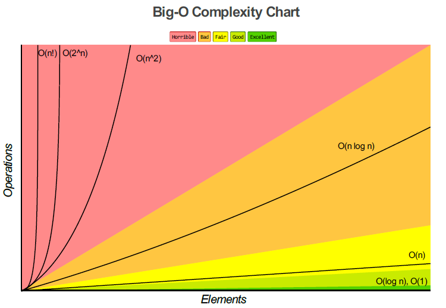

## Big O performance ( Know Thy Complexities! ) ##

### Big-O Complexity Chart ###

### Common Data Structure Operations ###

| Data Structure       | Time Complexity      |            |           |          |          |        |           |          | Space Complexity |
| -------------------- | -------------------- | ---------- | --------- | -------- | -------- | ------ | --------- | -------- | ---------------- |
|                      | Average              |            |           |          | Worst    |        |           |          | Worst            |
|                      | Access               | Search     | Insertion | Deletion | Access   | Search | Insertion | Deletion |                  |
|                      |                      |            |           |          |          |        |           |          |                  |
| Array                |  |  |  |  |  |  |  |  |  |
| Stack                |  |  |  |  |  |  |  |  |  |
| Queue                |  |  |  |  |  |  |  |  |  |
| Singly-Linked List   |  |  |  |  |  |  |  |  |  |
| Doubly-Linked List   |  |  |  |  |  |  |  |  |  |
| Skip List            |  |  |  |  |  |  |  |  |  |
| Hash Table           | N/A |  |  |  | N/A |  |  |  |  |
| Binary Search Tree   |  |  |  |  |  |  |  |  |  |
| Cartesian Tree       | N/A |  |  |  | N/A |  |  |  |  |
| B-Tree               |  |  |  |  |  |  |  |  |  |
| Red-Black Tree       |  |  |  |  |  |  |  |  |  |
| Splay Tree           | N/A |  |  |  | N/A |  |  |  |  |
| AVL Tree             |  |  |  |  |  |  |  |  |  |
| KD Tree              |  |  |  |  |  |  |  |  |  |

### Array Sorting Algorithms ###

| Algorithm            | Time Complexity      |                      |                      | Space Complexity         |
| -------------------- | -------------------- | -------------------- | -------------------- | ------------------------ |
|                      | Best                 | Average              | Worst                | Worst                    |
| Quicksort |  |  |  |  |
| Mergesort |  |  |  |  |
| Timsort  |  |  |  |  |
| Heapsort |  |  |  |  |
| Bubble Sort  |  |  |  |  |
| Insertion Sort  |  |  |  |  |
| Selection Sort |  |  |  |  |
| Tree Sort |  |  |  |  |
| Shell Sort |  |  |  |  |
| Bucket Sort |  |  |  |  |
| Radix Sort  |  |  |  |  |
| Counting Sort |  |  |  |  |
| Cubesort  |  |  |  |  |

### Big O cheatsheet ###

